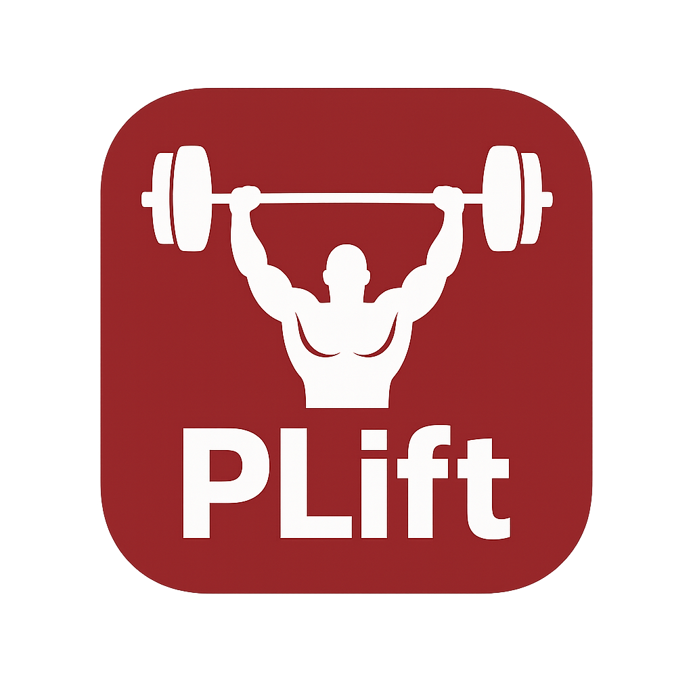

# PLift – Plataforma móvil inteligente para coaches y atletas

## Descripción
PLift es una app móvil con Inteligencia Artificial que genera planes de powerlifting personalizados y los ajusta automáticamente según rendimiento, fatiga y preparación para competencias. Optimiza la gestión de múltiples atletas y facilita el seguimiento para coaches y atletas.

## Problema
- Coaches con alta carga de trabajo.  
- Planes genéricos o estáticos que no se ajustan al rendimiento.  
- Falta de herramientas integrales para seguimiento y ajustes dinámicos.

## Objetivo
Desarrollar una app móvil que genere y ajuste ciclos de entrenamiento automáticamente, ofreciendo panel de control para coaches y métricas de progreso para atletas.

## Tecnologías
- **Frontend:** React Native + Expo  
- **Backend:** Firebase (Auth + Firestore)  
- **API:** FastAPI 

## Resultados esperados
- Ciclos de entrenamiento personalizados en segundos.  
- Ajuste automático de cargas y volumen.  
- Dashboard de progreso y panel de control para coaches.

